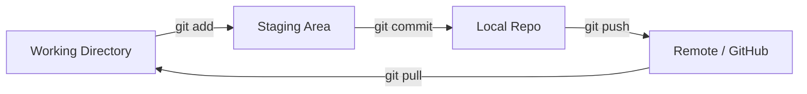

# 🧠 Understanding the Git Workflow

To be a professional, you must understand the **Three States** of Git. Most beginners get confused because they don't realize where their file actually "lives" in the Git lifecycle.

---

## 🏗️ The Three States

1.  **Modified (Working Directory):** You have changed the file, but have not committed it to your database yet. These are your raw files on disk.
2.  **Staged (Staging Area / Index):** You have marked a modified file in its current version to go into your next commit snapshot. Think of this as a "Ready to Ship" box.
3.  **Committed (Local Repo):** The data is safely stored in your local database (`.git` folder).

---

## 🗺️ The Flow Diagram

---

## 🛠️ Merge vs. Rebase
This is the most common debate for intermediate users.

### 🔀 Merge
*   **Pros:** Non-destructive. Complete history of how features were integrated.
*   **Cons:** History can become a "spaghetti" mess of merge commits.
*   **When to use:** Integrating a finished feature branch into `main`.

### 🛤️ Rebase
*   **Pros:** Clean, linear history. Easy to follow.
*   **Cons:** Rewrites history (dangerous on shared branches). Can lead to complex conflict resolution if done wrong.
*   **When to use:** Keeping your feature branch up-to-date with `main` while you are still working on it.

---

## 🔑 Why Git? (The Professional Perspective)
Professional development isn't just about saving files; it's about **traceability** and **collaboration**.
*   **Traceability:** If a bug is found today, Git helps us find exactly which line changed 3 months ago and *why* (via the commit message).
*   **Safety:** You can experiment fearlessly. You can always go back to a "Working" state.
*   **Parallelism:** Multiple devs can work on the same file in different branches and merge their logic later.

---
[⬅️ Back to Home](../README.md)
